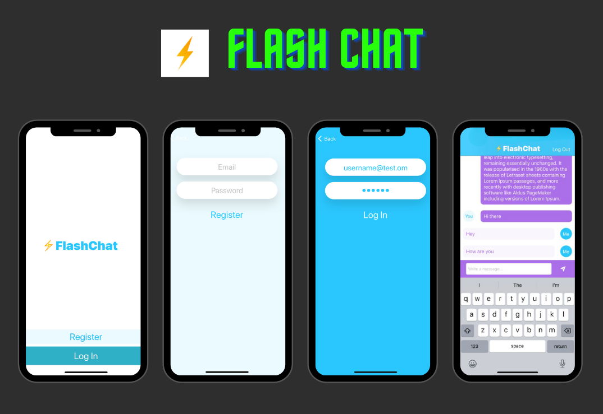

# Flash Chat 

Flash Chat is an internet based messaging app. This app is using a service called Firebase Firestore as a backend database to store and retrieve our messages from the cloud. Firebase for user authentication, registration and login.

## Screenshots

## Acknowledgements

 - [The App Brewery](https://www.appbrewery.co/)

